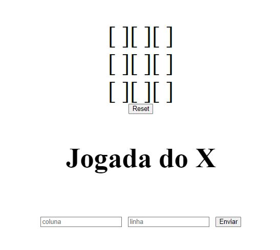

# 🎮 Jogo da velha

Nesse repositório você encontra uma implementação do jogo da velha (também chamado de Tic Tac Toe). Acredito que todo mundo já jogou esse jogo alguma vez, sendo assim, as regras se tornam bem mais fácil.

Regras:
- Só existem 2 jogadores (X e O)
- Os lugares em branco precisam ser preenchidos em turnos alternados obrigatóriamente
- O jogo termina quando uma sequência de três jogadas do mesmo jogador estiverem consecutivas (vertical, horizontal ou diagonal)

Aqui aplicamos varios conceitos sobre programação incluindo:

- Estruturação do HTML
    - Inserção de imagens dinâmicas
    - Inputs de texto e botões
- Estilização usando CSS
    - Propriedades de estilização (margin, font-size, padding, tables)
- PHP
    - Validações usando condicionais
    - Utilização de funções
    - Interação usando GET e POST no PHP
    - Manipulação de vetores e matrizes
    - Utilização de sessões 

# 💻 O que nós usamos?

Para implementar essa versão do nosso jogo utilizamos tecnologias livres que são listadas abaixo:

Versão em PHP:
- 
- 
- 

# Snapshots

